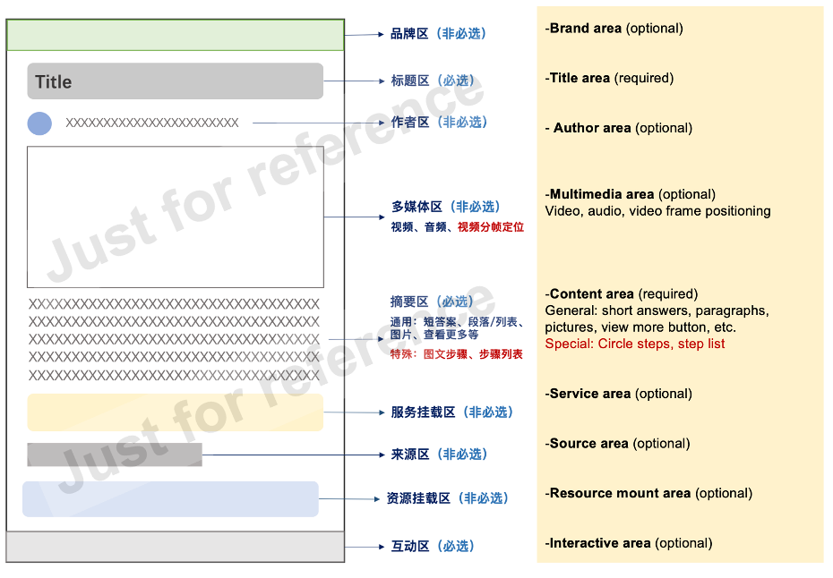

## Info

Search Engine Optimization (from Baidu Co.)
The project is called **'Enhance users’ perception of featured snippets'**, which mainly about optimizate the quality, styles and interactions of featured snippets.

### The definition of featured snippets

Featured snippets are also called as selected Q&A which is the content displayed in the first place of search results. 

Unlike traditional search engines that show a series of website links, featured snippets more efficiently meet the needs of users, directly provide users with an answer to their search queries, and display the answer of the website as a short text, list, or table, as well as the accompanying images or videos.

### Schematic diagram of Featured Snippets from Baidu

![overall]](overall.png)

The search query is 'yyds means' in the picture, YYDS is a Chinese Internet buzzword, which is the abbreviation of 'Forever God' (same as 'GOAT' in English).

Visit the link to see：[PC web](https://www.baidu.com/s?wd=yyds%E4%BB%80%E4%B9%88%E6%84%8F%E6%80%9D).

### Details of the project

Due to the confidentiality of the project, some special information needs to be kept confidential.

#### Background

The overall classification of Featured Snippets' current style is complex, and the content distinction between good quality and relatively poor quality is not high, which affects the user's overall cognition of featured snippets. It is mainly reflected in two reasons: 

- The difference between the style of high-quality content and ordinary content is small, which needs to be clearly defined and distinguished.
- The accuracy of content grading (the system defines which one is a better result) is low, need to be clarify and improve.

#### Logical framework of Featured Snippets

#### Project design drawing

